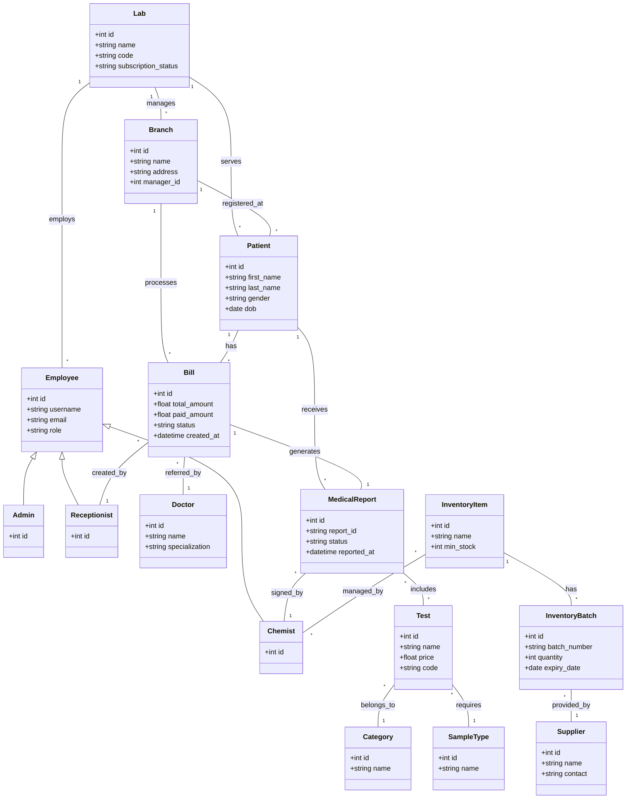

# Class Diagram: Lab-Manager System

This document provides a detailed explanation of the data structure and entity relationships within the Lab-Manager (Cura) system, followed by a breakdown of the system into five logical domains.

---

## Diagram

---

## 1. Core Organizational Domain
This domain defines the multi-tenant structure of the software.
*   **Lab:** The root entity representing a laboratory organization. It holds global settings and subscription status. All other data is scoped to a Lab to ensure data isolation.
*   **Branch:** Labs can have multiple physical locations. A Branch manages its own subset of patients and staff, but remains under the parent Lab's umbrella.

## 2. User & Access Control Domain
The system uses a hierarchical and role-based approach to user management.
*   **Employee:** The base class for all staff members. It contains core identity data (username, email, role).
    *   **Admin:** Inherits from Employee. Has full managerial rights over branches and staff.
    *   **Chemist:** Inherits from Employee. Specialized in laboratory technical tasks.
    *   **Receptionist:** Inherits from Employee. Focused on patient onboarding and billing.
*   **Patient:** A separate entity representing the client. Linked to a specific Lab and Branch where they were first registered.
*   **Doctor:** Represents medical professionals who refer patients. They can be external or contracted with the lab.

## 3. Medical Operations Domain
The "heart" of the system where medical tests and results are defined.
*   **Test:** Represents a specific medical analysis (e.g., Blood Sugar, Liver Function). It includes pricing and technical configuration (structure_config).
*   **Category:** Groups tests for better organization (e.g., Biochemistry, Hematology).
*   **SampleType:** Defines what kind of specimen is needed for a test (e.g., Serum, Whole Blood, Urine).
*   **MedicalReport:** The primary document produced by the lab. It links a Patient and a Bill to a set of verified Test results.

## 4. Billing & Financial Domain
Manages the revenue lifecycle of the laboratory.
*   **Bill:** A financial transaction record. It captures the total amount, paid amount, and payment status.
*   **Bill_Has_Test / Bill_Has_Package:** Junction tables that track exactly which services were charged in a single bill.
*   **Status:** A lookup table for payment and operational statuses (e.g., Pending, Paid, Refunded).

## 5. Inventory Domain
Tracks the supplies needed to perform tests.
*   **InventoryItem:** Represents a reagent or consumable (e.g., Glucose Strips, Alcohol Swabs). It tracks "Min Stock" for automated alerts.
*   **InventoryBatch:** Specific shipments of items. Includes vital data like "Expiry Date" and "Batch Number" for quality control.
*   **Supplier:** Information about the vendors providing the inventory items.

---

## 6. Key Data Relationships

### One-to-Many Relationships
*   **Lab ↔ Branch:** One Lab can manage multiple physical locations.
*   **Patient ↔ Bill:** One Patient can have many bills over time.
*   **Branch ↔ Staff:** A Branch is managed by an Admin and staffed by multiple Chemists and Receptionists.

### Many-to-Many Relationships
*   **MedicalReport ↔ Test:** A single report can contain multiple test results, and a single type of test can appear in thousands of different reports.
*   **Bill ↔ Packages/Offers:** A bill can combine multiple discounted packages and individual tests.
*   **Patient ↔ Diseases:** Used for medical history tracking; a patient can have multiple chronic conditions, and a disease can affect multiple patients.
