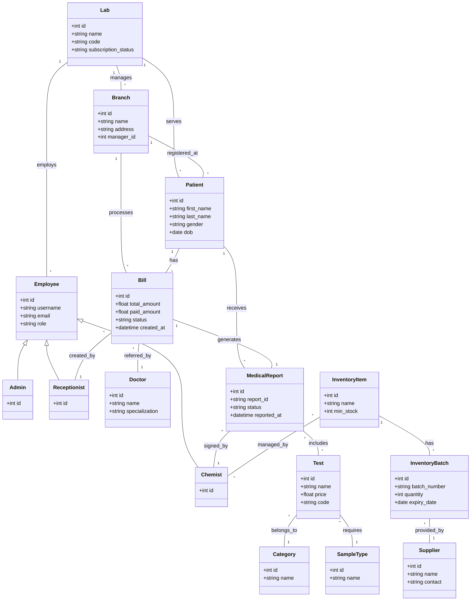

```mermaid
classDiagram
    class Lab {
        +int id
        +string name
        +string code
        +string subscription_status
    }

    class Branch {
        +int id
        +string name
        +string address
        +int manager_id
    }

    class Employee {
        +int id
        +string username
        +string email
        +string role
    }

    class Admin {
        +int id
    }

    class Chemist {
        +int id
    }

    class Receptionist {
        +int id
    }

    class Patient {
        +int id
        +string first_name
        +string last_name
        +string gender
        +date dob
    }

    class Doctor {
        +int id
        +string name
        +string specialization
    }

    class Bill {
        +int id
        +float total_amount
        +float paid_amount
        +string status
        +datetime created_at
    }

    class MedicalReport {
        +int id
        +string report_id
        +string status
        +datetime reported_at
    }

    class Test {
        +int id
        +string name
        +float price
        +string code
    }

    class Category {
        +int id
        +string name
    }

    class SampleType {
        +int id
        +string name
    }

    class InventoryItem {
        +int id
        +string name
        +int min_stock
    }

    class InventoryBatch {
        +int id
        +string batch_number
        +int quantity
        +date expiry_date
    }

    class Supplier {
        +int id
        +string name
        +string contact
    }

    %% Relationships
    Lab "1" -- "*" Branch : manages
    Lab "1" -- "*" Employee : employs
    Lab "1" -- "*" Patient : serves
    
    Branch "1" -- "*" Patient : registered_at
    Branch "1" -- "*" Bill : processes
    
    Employee <|-- Admin
    Employee <|-- Chemist
    Employee <|-- Receptionist
    
    Patient "1" -- "*" Bill : has
    Patient "1" -- "*" MedicalReport : receives
    
    Bill "1" -- "1" MedicalReport : generates
    Bill "*" -- "1" Receptionist : created_by
    Bill "*" -- "1" Doctor : referred_by
    
    MedicalReport "*" -- "*" Test : includes
    MedicalReport "*" -- "1" Chemist : signed_by
    
    Test "*" -- "1" Category : belongs_to
    Test "*" -- "1" SampleType : requires
    
    InventoryItem "1" -- "*" InventoryBatch : has
    InventoryBatch "*" -- "1" Supplier : provided_by
    InventoryItem "*" -- "*" Chemist : managed_by
```
