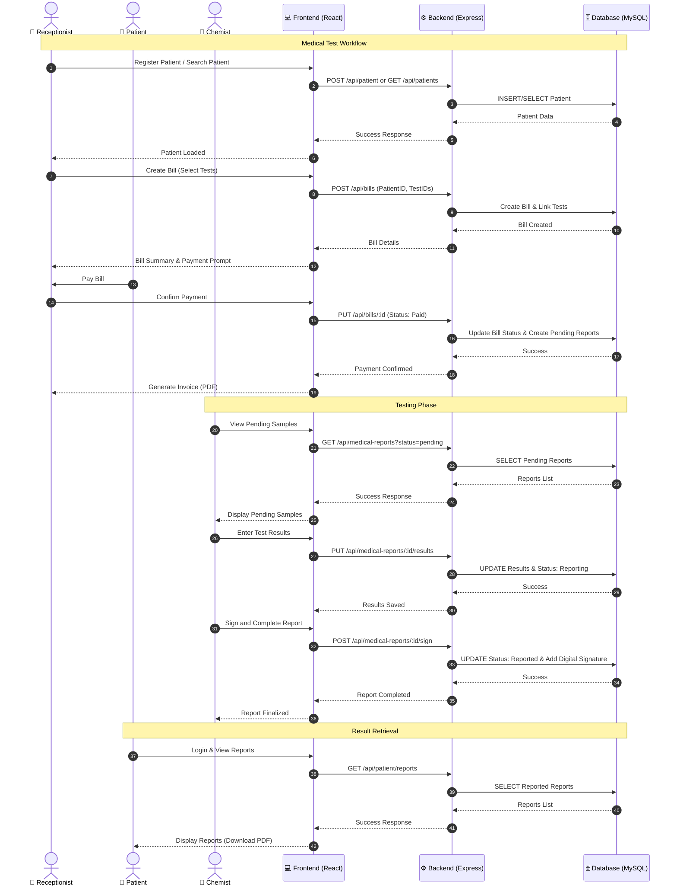

# Sequence Diagram: Lab Test Lifecycle

This document describes the step-by-step flow of a typical medical test within the Lab-Manager (Cura) system, from the moment a patient arrives to the delivery of the final report.

---

## Diagram

---

## Phase 1: Patient Registration & Invoicing
**Actors: Patient & Receptionist**

1.  **Patient Identification:** The Receptionist searches for an existing patient or registers a new one via the Frontend. The Backend validates the data and stores/retrieves it from the Database.
2.  **Order Entry:** The Receptionist selects the requested tests based on the patient's referral.
3.  **Bill Creation:** The Backend generates a Bill record, calculating totals, discounts, and tax.
4.  **Payment Processing:** The Patient pays for the services. Once the Receptionist confirms the payment in the system, the Bill status is updated to "Paid".
5.  **Documentation:** The system automatically generates a PDF Invoice for the patient.

---

## Phase 2: Laboratory Workflow (The Testing Phase)
**Actors: Chemist**

1.  **Sample Collection:** The Chemist views a list of "Pending" reports. When they physically receive the specimen, they mark it as "Collected" in the system. This logs the `collected_at` timestamp for Turnaround Time (TAT) monitoring.
2.  **Result Entry:** After performing the analysis, the Chemist enters the results into a dynamic form.
3.  **Validation:** The Backend's **Calculation Engine** automatically evaluates any "Calculated Fields" (e.g., calculating LDL based on Total Cholesterol and HDL) and flags results that fall outside the normal reference ranges.
4.  **Reporting:** The Chemist saves the results, and the report status moves from "Pending" to "Reporting".

---

## Phase 3: Verification & Finalization
**Actors: Chemist or Admin**

1.  **Technical Review:** A senior Chemist or Admin reviews the entered data for accuracy.
2.  **Digital Signature:** The authorized staff member signs the report. The system attaches their digital signature and a unique QR code to the document.
3.  **Status Update:** The report is marked as "Done" and the `reported_at` timestamp is recorded.

---

## Phase 4: Result Retrieval
**Actors: Patient**

1.  **Secure Access:** The Patient logs into the portal using their unique credentials.
2.  **Notification:** The system displays all reports with the "Reported" status.
3.  **Delivery:** The Patient can view the interactive report or download the professional PDF version directly to their device.

---

## Technical Interaction Summary

*   **Frontend (React):** Handles user inputs, displays real-time validation, and triggers PDF generation.
*   **Backend (Node.js):** Manages the business logic, executes the Calculation Engine, handles role-based authorization, and coordinates database transactions.
*   **Database (MySQL):** Ensures data integrity and persists the state of every report and financial transaction.
