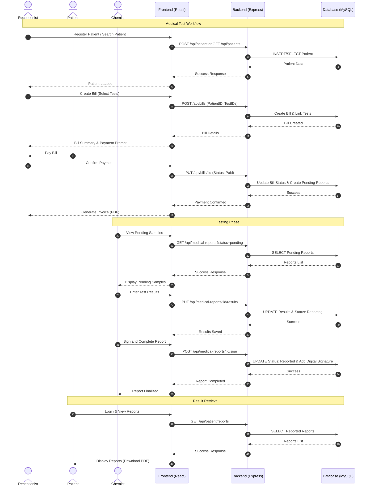

```mermaid
sequenceDiagram
    autonumber
    actor R as Receptionist
    actor P as Patient
    actor C as Chemist
    participant F as Frontend (React)
    participant B as Backend (Express)
    participant DB as Database (MySQL)

    Note over R, DB: Medical Test Workflow

    R->>F: Register Patient / Search Patient
    F->>B: POST /api/patient or GET /api/patients
    B->>DB: INSERT/SELECT Patient
    DB-->>B: Patient Data
    B-->>F: Success Response
    F-->>R: Patient Loaded

    R->>F: Create Bill (Select Tests)
    F->>B: POST /api/bills (PatientID, TestIDs)
    B->>DB: Create Bill & Link Tests
    DB-->>B: Bill Created
    B-->>F: Bill Details
    F-->>R: Bill Summary & Payment Prompt

    P->>R: Pay Bill
    R->>F: Confirm Payment
    F->>B: PUT /api/bills/:id (Status: Paid)
    B->>DB: Update Bill Status & Create Pending Reports
    DB-->>B: Success
    B-->>F: Payment Confirmed
    F-->>R: Generate Invoice (PDF)

    Note over C, DB: Testing Phase

    C->>F: View Pending Samples
    F->>B: GET /api/medical-reports?status=pending
    B->>DB: SELECT Pending Reports
    DB-->>B: Reports List
    B-->>F: Success Response
    F-->>C: Display Pending Samples

    C->>F: Enter Test Results
    F->>B: PUT /api/medical-reports/:id/results
    B->>DB: UPDATE Results & Status: Reporting
    DB-->>B: Success
    B-->>F: Results Saved

    C->>F: Sign and Complete Report
    F->>B: POST /api/medical-reports/:id/sign
    B->>DB: UPDATE Status: Reported & Add Digital Signature
    DB-->>B: Success
    B-->>F: Report Completed
    F-->>C: Report Finalized

    Note over P, DB: Result Retrieval

    P->>F: Login & View Reports
    F->>B: GET /api/patient/reports
    B->>DB: SELECT Reported Reports
    DB-->>B: Reports List
    B-->>F: Success Response
    F-->>P: Display Reports (Download PDF)
```
