# Use Case Diagram: Lab-Manager System

This document covers the full use case diagram showing all system actors and the operations they perform, followed by a detailed plain-language description of each element.

---

## Diagram

```mermaid
graph TD
    P["🧑 Patient"]
    R["🧑 Receptionist"]
    C["🧬 Chemist"]
    D["🩺 Doctor"]
    A["👑 Admin"]
    E["👤 Employee"]

    UC1["Login"]
    UC2["Logout"]
    UC3["Reset Password"]
    UC4["Register Patient"]
    UC5["Update Profile"]
    UC6["View Medical History"]
    UC7["Request Test"]
    UC8["Collect Sample"]
    UC9["Enter Test Results"]
    UC10["Sign & Verify Report"]
    UC11["View/Download Report"]
    UC12["Generate Invoice"]
    UC13["Process Payment"]
    UC14["Manage Packages & Offers"]
    UC15["Manage Corporate Contracts"]
    UC16["Track Stock Levels"]
    UC17["Manage Suppliers"]
    UC18["Receive Inventory Batches"]
    UC19["Manage Branches"]
    UC20["Manage Employees"]
    UC21["View Analytics Dashboard"]
    UC22["System Configuration"]

    E --> UC1
    E --> UC2
    P --> UC1
    P --> UC2
    P --> UC3
    P --> UC5
    P --> UC11

    R --> UC4
    R --> UC7
    R --> UC12
    R --> UC13

    C --> UC8
    C --> UC9
    C --> UC10
    C --> UC16
    C --> UC18

    D --> UC6
    D --> UC11

    A --> UC14
    A --> UC15
    A --> UC17
    A --> UC19
    A --> UC20
    A --> UC21
    A --> UC22
    A --> UC10
```

---

## 1. System Actors (Who uses the system?)

The system defines six primary actors, categorized into staff and external users:

### Staff Roles (Employees)
*   **Employee (General Role):** A base role representing any staff member. They share common capabilities like basic authentication and profile management.
*   **Receptionist:** The first point of contact. They handle patient onboarding, appointment scheduling, and financial transactions (billing).
*   **Chemist:** The technical backbone of the lab. They manage the physical sample collection, perform medical tests, enter technical results, and monitor lab inventory.
*   **Admin:** The system overseer. They manage high-level configurations, staff accounts, branch operations, and financial analytics.
*   **Doctor:** A specialized medical actor who uses the system to review patient history and access verified medical reports for diagnostic purposes.

### External Roles
*   **Patient:** The end consumer. They interact with the system to manage their own profile, view their medical history, and securely download their test results.

---

## 2. Detailed Use Case Breakdown

The system functionality is organized into six functional "packages":

### A. Authentication (Security & Access)
This module is the entry point for all users. It ensures that data is only accessible to authorized individuals.
*   **Login:** Users provide credentials (username/email and password) to gain access. The system uses JWT (JSON Web Tokens) to maintain a secure session.
*   **Logout:** Terminates the session and clears local security tokens to prevent unauthorized access on shared devices.
*   **Reset Password:** A self-service workflow for users who have forgotten their credentials, typically involving email verification.

### B. Patient Management (Customer Relationship)
Focuses on the data lifecycle of the laboratory's clients.
*   **Register Patient:** Performed by the **Receptionist**. Captures personal details, contact information, and assigns a unique Patient ID.
*   **Update Profile:** Allows both the **Patient** and staff to keep contact information and personal details current.
*   **View Medical History:** A critical view for **Doctors** and **Patients** to see past test results and chronic conditions, enabling longitudinal health tracking.

### C. Medical Operations (The Core Laboratory Workflow)
This represents the primary business logic of the lab.
*   **Request Test:** The **Receptionist** adds specific tests (e.g., CBC, Glucose) to a patient's order based on a doctor's referral.
*   **Collect Sample:** The **Chemist** marks when a physical sample (blood, urine, etc.) has been received, which triggers the Turnaround Time (TAT) tracking.
*   **Enter Test Results:** The **Chemist** inputs the quantitative or qualitative findings for each test component.
*   **Sign & Verify Report:** A multi-stage process. A **Chemist** or **Admin** must digitally sign the report to verify its accuracy before it is released to the patient.
*   **View/Download Report:** Once verified, the **Patient** and **Doctor** can access the final PDF report, which includes security features like QR codes for authenticity.

### D. Billing & Finance (Revenue & Contract Management)
Handles the commercial side of the laboratory operations.
*   **Generate Invoice:** Automatically creates a financial document when tests are ordered, applying appropriate pricing from the global catalog.
*   **Process Payment:** Records the transaction (Cash, Card, or Wallet). The system tracks partial payments and outstanding balances.
*   **Manage Packages & Offers:** The **Admin** creates "Bundles" (e.g., "Full Body Checkup") where multiple tests are offered at a discounted rate.
*   **Manage Corporate Contracts:** Handles bulk billing and special pricing for companies or insurance providers who send patients to the lab.

### E. Inventory Management (Supply Chain)
Ensures the lab never runs out of essential reagents and supplies.
*   **Track Stock Levels:** Real-time monitoring of reagents. The system emits alerts (via WebSockets) when stock falls below a safety threshold.
*   **Manage Suppliers:** Maintaining a database of vendors who provide lab supplies.
*   **Receive Inventory Batches:** Recording the arrival of new stock, including tracking expiry dates to ensure only valid materials are used in testing.

### F. System Administration (Operational Control)
The "Control Tower" used by laboratory management.
*   **Manage Branches:** In a multi-branch setup, the **Admin** can configure details for different physical locations.
*   **Manage Employees:** Creating staff accounts, assigning roles (RBAC), and monitoring staff activity.
*   **View Analytics Dashboard:** High-level charts showing revenue trends, test volumes, and staff performance metrics.
*   **System Configuration:** Setting global parameters like lab letterheads, digital signature images, and report templates.

---

## 3. Actor-Specific Scenarios

### The Receptionist's Workflow
1. A patient arrives; the Receptionist **Registers** them.
2. They **Request a Test** and **Generate an Invoice**.
3. They **Process Payment** and hand the patient a receipt.

### The Chemist's Workflow
1. The Chemist sees a new request and **Collects the Sample**.
2. They perform the analysis and **Enter Test Results**.
3. They **Sign and Verify** the report, making it available instantly.

### The Admin's Workflow
1. The Admin checks the **Analytics Dashboard** for the day's revenue.
2. They notice a low stock alert and **Manage Suppliers** to reorder reagents.
3. They **Manage Employees** to onboard a new technician.
